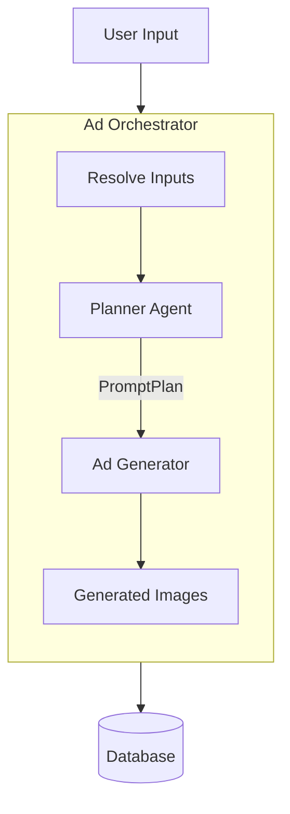

# Ad Workflow Implementation Plan

This plan implements the Ad Workflow architecture defined in `docs/ad-workflow-implementation-plan.md`, now updated to include explicit moodboard integration.

## Architecture

The workflow uses a two-step process:

1.  **Planner**: Analyzes inputs (custom instructions, moodboard, product context) to generate a structured `PromptPlan`.
2.  **Executor**: Takes the plan and generates images using the Gemini model.

## Implementation Steps

### 1. Shared Planner Logic

Create [`lib/ai/planner.ts`](lib/ai/planner.ts) to implement the "Brain" of the operation.

-   Use `generateObject` from Vercel AI SDK.
-   Analyze inputs (`custom_instructions`, `moodboard`).
-   **Moodboard Integration**: Extract and utilize `styleProfile.reference_positive_summary`, `reference_negative_summary`, `backgrounds_analysis_summary`, and `models_analysis_summary` to guide creative direction.
-   Output `AdPromptPlan` (prompts + rationale).

### 2. Shared Ad Generator

Create [`lib/ai/ad-generator.ts`](lib/ai/ad-generator.ts) to implement the "Hand".

-   Accept prompts from the Planner.
-   **Moodboard Integration**: Inject `positiveReferenceSummary`, `negativeReferenceSummary`, and `styleAppendix` into the final prompt construction to reinforce style.
-   Interact with `google/gemini-2.5-flash-image` (or configured provider).
-   Handle image uploads to Blob storage.
-   Support flexible aspect ratios.

### 3. Apparel Ad Orchestrator

Create [`lib/workflows/generation/apparel/ad-execute.ts`](lib/workflows/generation/apparel/ad-execute.ts).

-   Handle apparel-specific inputs (garment analysis, masking).
-   Call `planAdCampaign` with apparel context and full moodboard.
-   Call `generateAdImages`.
-   Save results to DB.

### 4. Non-Apparel Ad Orchestrator

Create [`lib/workflows/generation/non-apparel/ad-execute.ts`](lib/workflows/generation/non-apparel/ad-execute.ts).

-   Handle non-apparel specific inputs.
-   Call `planAdCampaign` with non-apparel context and full moodboard.
-   Call `generateAdImages`.
-   Save results to DB.

### 5. Workflow Integration

Update [`lib/workflows/generation/workflows.ts`](lib/workflows/generation/workflows.ts).

-   Import the new `execute` functions.
-   Register them for `apparel.ads.v1` and `non_apparel.ads.v1`.