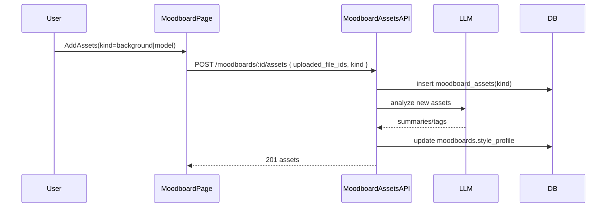

# Enhance moodboards with backgrounds + models

## Goal

- Extend moodboards to have **two more asset sections**: **Backgrounds** and **Models**.
- Add a dedicated moodboard page for managing these assets easily.
- After creating a moodboard, **navigate to the moodboard detail page**.
- During generation, **pass moodboard background/model references to workflows**:
  - **Strict**: attach a limited, auto-selected subset (e.g. **1–3 backgrounds + 1–3 models**) as reference images.
  - **Inspired**: attach **no images**, but include moodboard style/analysis text.
- Store LLM-derived analysis **inside `moodboards.style_profile` JSON**.

## Data model changes

### Add asset kind to moodboard assets

- Update DB schema:
  - Add `kind` column to `moodboard_assets` (enum-like text): `background | model | reference`.
  - Default existing rows to `reference`.

Files:

- [`lib/db/schema.ts`](lib/db/schema.ts)
- New migration in [`lib/db/migrations/`](lib/db/migrations/)

### Store moodboard asset analysis in style profile

- Extend `moodboards.style_profile` JSON to include computed fields:
  - `backgrounds_analysis_summary`
  - `models_analysis_summary`
  - optionally `asset_analysis_version`, timestamps

No DB schema change required (already JSONB).

## API changes

### 1) Moodboard assets API supports kinds

Update `[app/api/moodboards/[moodboardId]/assets/route.ts](app/api/moodboards/[moodboardId]/assets/route.ts)`:

- **GET**: accept `?kind=background|model|reference|all` (default `all`).
- **POST**: accept payload `{ uploaded_file_ids: number[], kind: 'background'|'model'|'reference' }`.

Update DB helpers in [`lib/db/moodboards.ts`](lib/db/moodboards.ts):

- `listMoodboardAssets(teamId, moodboardId, { kind? })`
- `addMoodboardAssets(teamId, moodboardId, uploadedFileIds, kind)`

### 2) Moodboard analysis pipeline (LLM)

When assets are added (POST assets):

- Trigger analysis:
  - Fetch newly-added asset URLs (signed same-origin like today).
  - Call LLM to produce two things:
    - Per-asset tags (optional v1)
    - Aggregated summaries for backgrounds/models
  - Update `moodboards.style_profile` to include these summaries.

Implementation note: do this asynchronously if latency becomes an issue (can start sync for v1).

## UI changes

### 1) Dedicated moodboard detail page

Add route:

- `[app/(dashboard)/dashboard/moodboards/[moodboardId]/page.tsx](app/(dashboard)/dashboard/moodboards/[moodboardId]/page.tsx)`

Page UX:

- Header: name, description, last updated
- Tabs/sections:
  - **Backgrounds**: grid, upload/add flow
  - **Models**: grid, upload/add flow
- Upload flow should reuse existing uploads system:
  - show available uploads `GET /api/uploads?kind=moodboard`
  - allow multi-select and “Add to Backgrounds/Models”
  - optionally allow direct upload (if already supported in uploads UI)

### 2) Navigate to moodboard page after creation

Update create flow in `[app/(dashboard)/dashboard/moodboards/page.tsx](app/\\(dashboard)/dashboard/moodboards/page.tsx)`:

- After `POST /api/moodboards` returns `{ moodboard: { id } }`, do `router.push('/dashboard/moodboards/' + id)` and close the modal.

## Generation wiring (pass background/model references)

### Resolve moodboard assets by kind

Update moodboard resolution in:

- `[app/api/products/[productId]/variants/[variantId]/generations/route.ts](app/api/products/[productId]/variants/[variantId]/generations/route.ts)`
- [`app/api/batches/route.ts`](app/api/batches/route.ts)

Instead of treating all moodboard assets equally:

- Fetch and split:
  - `backgroundAssetUrls` (kind=background)
  - `modelAssetUrls` (kind=model)
  - (optional) `referenceAssetUrls` (kind=reference)

### Strict mode selection

- Add a small selection policy:
  - `pickN(backgroundAssetUrls, 3)` and `pickN(modelAssetUrls, 3)`
  - deterministic (seed by `variantId` or `generation jobId`) to avoid flicker

Attach these as `extraReferenceImageUrls` (plus anything else you already attach).

### Inspired mode

- `extraReferenceImageUrls = []`
- Enrich `style_appendix` using the analysis summaries stored in `style_profile` (e.g. “Backgrounds: ... Models: ...”).

### Pipeline workflows

For workflows with `execute(...)` that receive the `moodboard` object, extend the object shape to include:

- `backgroundAssetUrls: string[]`
- `modelAssetUrls: string[]`
- `analysisSummary?: { backgrounds: string; models: string }`

So pipeline steps can decide how to use the references.

## Mermaid: new moodboard asset flow

## Verification checklist

- Create moodboard → redirected to `/dashboard/moodboards/:id`.
- Upload/add assets into Backgrounds and Models; assets list filtered by kind.
- Generation:
  - Strict: job metadata `extraReferenceImageUrls` includes selected backgrounds+models.
  - Inspired: job metadata references empty; prompt includes style_appendix enriched with analysis.