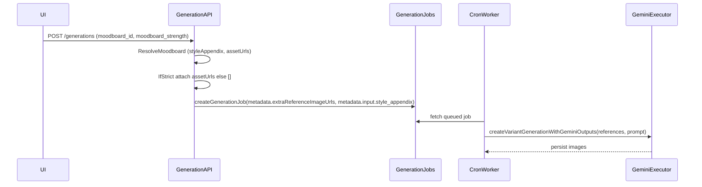

# Moodboard strictness setting (Strict vs Inspired)

## Goal

Implement a **two-level moodboard strictness** control (only shown when a moodboard is selected) across **single** and **bulk/batch** generation forms.

- **Strict**: attach moodboard images as reference images during generation (current `assetUrls` behavior).
- **Inspired**: **do not** attach moodboard images; only use moodboard-derived **style appendix / analysis text** in the prompt.
- **Scope**: strictness is **per request** (not stored on the moodboard).

## Current architecture touchpoints

- Moodboards are passed via `input.moodboard_id` and resolved in the generation API route. The API currently produces:
  - `styleAppendix` (text)
  - `assetUrls` (signed same-origin URLs)
  - and then passes them through job metadata (`extraReferenceImageUrls`, `style_appendix`).
  - See flow described in [`docs/how-to-add-a-workflow.md`](docs/how-to-add-a-workflow.md).

## Implementation steps

### 1) Add a request-level strictness field to generation inputs

- **Add** a new input field (per request) under generation `input`, e.g.:
  - `moodboard_strength: 'strict' | 'inspired'`
- Update:
  - [`lib/workflows/generation/types.ts`](lib/workflows/generation/types.ts) base input type.
  - [`lib/workflows/generation/workflows.ts`](lib/workflows/generation/workflows.ts) zod `baseGenerationInputSchema`.

Decision: keep name stable and explicit (e.g. `moodboard_strength`), so it’s queryable/auditable in `variant_generations.input`.

### 2) Wire strictness through single-variant generation API

- Update `[app/api/products/[productId]/variants/[variantId]/generations/route.ts](app/api/products/[productId]/variants/[variantId]/generations/route.ts)`:
  - After moodboard resolution, read `workflowInput.moodboard_strength`.
  - Compute `extraReferenceImageUrls` based on strictness:
    - **Strict**: `extraReferenceImageUrls = moodboard.assetUrls`
    - **Inspired**: `extraReferenceImageUrls = []`
  - Continue passing `style_appendix` regardless (both modes).
  - Persist the strictness choice in job metadata input snapshot (e.g. inside `metadata.input`).

### 3) Wire strictness through batch generation API

- Locate the batch generation submit path (likely in [`components/batches/batch-generation-settings-form.tsx`](components/batches/batch-generation-settings-form.tsx) and the corresponding API route(s), e.g. [`app/api/batches/...`](app/api/batches).
- Ensure the batch request payload includes `moodboard_strength` inside the generation input.
- Ensure the backend that creates generation jobs for batches applies the same rule:
  - **Strict** → include moodboard `assetUrls` as references
  - **Inspired** → references empty

### 4) Ensure job processing honors strictness

- Confirm the queue worker uses `extraReferenceImageUrls` to fetch reference images.
- Update any job metadata typing to include the new field if needed:
  - [`lib/db/generation-jobs.ts`](lib/db/generation-jobs.ts)
- Validate that the generation executor uses the provided reference list:
  - [`lib/db/generations.ts`](lib/db/generations.ts)

### 5) Update the single generation form UI

- In the single-variant UI page (the modal in `[app/(dashboard)/dashboard/products/[productId]/variants/[variantId]/page.tsx](app/(dashboard)/dashboard/products/[productId]/variants/[variantId]/page.tsx)`):
  - Show strictness control **only when** `moodboard_id` is set.
  - Two options:
    - **Strict** (label: “Use moodboard images as references”)
    - **Inspired** (label: “Use moodboard style only”)
  - Add helper text: “Custom instructions override moodboard guidance.”
  - Default to **Inspired** when a moodboard is chosen.

### 6) Update the batch generation form UI

- In [`components/batches/batch-generation-settings-form.tsx`](components/batches/batch-generation-settings-form.tsx):
  - Mirror the same conditional strictness control (visible only when moodboard selected).
  - Ensure it is included in the submitted payload.

### 7) Validation + auditability

- Add server-side validation so `moodboard_strength` must be one of the allowed values when present.
- Persist the chosen strictness in the generation record input snapshot so you can audit “why did this look like the moodboard?” later.

### 8) Verification checklist

- **Single variant**:
  - Moodboard selected + Inspired → job metadata has `extraReferenceImageUrls: []` and prompt includes `style_appendix`.
  - Moodboard selected + Strict → job metadata has `extraReferenceImageUrls` populated with moodboard `assetUrls`.
- **Batch**:
  - Same two cases, but via batch submit flow.
- Confirm generated outputs differ in behavior between strict/inspired for the same product + moodboard.

## Files likely to change

- [`lib/workflows/generation/types.ts`](lib/workflows/generation/types.ts)
- [`lib/workflows/generation/workflows.ts`](lib/workflows/generation/workflows.ts)
- `[app/api/products/[productId]/variants/[variantId]/generations/route.ts](app/api/products/[productId]/variants/[variantId]/generations/route.ts)`
- `[app/(dashboard)/dashboard/products/[productId]/variants/[variantId]/page.tsx](app/(dashboard)/dashboard/products/[productId]/variants/[variantId]/page.tsx)`
- [`components/batches/batch-generation-settings-form.tsx`](components/batches/batch-generation-settings-form.tsx)
- [`lib/db/generation-jobs.ts`](lib/db/generation-jobs.ts) (typing only, if needed)
- Batch API route(s) under [`app/api/batches/`](app/api/batches/) (exact file depends on your current submit endpoint)

## Mermaid: request-to-execution flow

