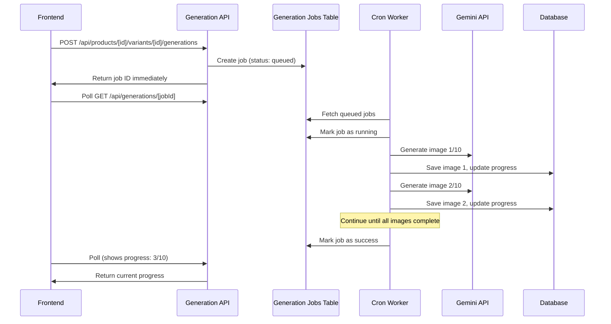

# Queue-Based Image Generation Implementation

## Overview

Transform synchronous image generation into an asynchronous queue-based system to handle long-running operations (10+ images) without frontend timeouts.

## Architecture



## Database Schema

### New Table: `generation_jobs`

Create a new table similar to `commerce_jobs` but for image generation:

**File**: `lib/db/schema.ts`

```typescript
export const generationJobs = pgTable(
  'generation_jobs',
  {
    id: serial('id').primaryKey(),
    teamId: integer('team_id').notNull().references(() => teams.id),
    productId: integer('product_id').notNull().references(() => products.id),
    variantId: integer('variant_id').notNull().references(() => productVariants.id),
    generationId: integer('generation_id').references(() => variantGenerations.id),
    
    type: varchar('type', { length: 50 }).notNull(), // 'image_generation' | 'image_edit'
    status: varchar('status', { length: 20 }).notNull().default('queued'), // queued|running|success|failed|canceled
    
    progress: jsonb('progress'), // { current: 3, total: 10, completedImages: [1, 2, 3] }
    error: text('error'),
    metadata: jsonb('metadata'), // job input data + zipUrl (after completion)
    
    startedAt: timestamp('started_at'),
    completedAt: timestamp('completed_at'),
    createdAt: timestamp('created_at').notNull().defaultNow(),
    updatedAt: timestamp('updated_at').notNull().defaultNow(),
  },
  (t) => ({
    teamIdx: index('generation_jobs_team_id_idx').on(t.teamId),
    variantIdx: index('generation_jobs_variant_id_idx').on(t.variantId),
    statusIdx: index('generation_jobs_status_idx').on(t.status),
    typeStatusIdx: index('generation_jobs_type_status_idx').on(t.type, t.status),
  })
);
```

**Migration**: Create `lib/db/migrations/0011_generation_jobs.sql`

## Backend Changes

### 1. Generation Jobs DB Layer

**File**: `lib/db/generation-jobs.ts` (new)

Create CRUD operations similar to `lib/commerce/jobs.ts`:

- `createGenerationJob()` - Create a new job
- `getGenerationJobById()` - Get job by ID
- `updateGenerationJob()` - Update job status/progress
- `getQueuedGenerationJobs()` - Get jobs for worker
- `markJobRunning()`, `markJobSuccess()`, `markJobFailed()` - Status helpers

### 2. Modify Generation API Route

**File**: `app/api/products/[productId]/variants/[variantId]/generations/route.ts`

**Changes**:

- Instead of calling `createVariantGenerationWithGeminiOutputs()` directly, create a job
- Return job ID immediately (status 202 Accepted)
- Keep credit check before queuing (fail fast if insufficient credits)
```typescript
// After credit check, create job instead of generating
const job = await createGenerationJob(team.id, {
  productId: pid,
  variantId: vid,
  type: 'image_generation',
  metadata: {
    schemaKey,
    input: workflowInput,
    numberOfVariations,
    prompt: workflow.buildPrompt(...),
    moodboardId: moodboard?.id ?? null,
    // ... other input data
  }
});

return Response.json({ 
  job: { id: job.id, status: job.status },
  message: 'Generation queued'
}, { status: 202 });
```


### 3. New Job Status API Endpoint

**File**: `app/api/generations/[jobId]/route.ts` (new)

```typescript
export async function GET(request: Request, { params }: { params: Promise<{ jobId: string }> }) {
  const team = await getTeamForUser();
  const { jobId } = await params;
  const job = await getGenerationJobById(team.id, parseInt(jobId));
  
  if (!job) return Response.json({ error: 'Not found' }, { status: 404 });
  
  // If completed, fetch the actual generation and images
  let generation = null;
  let images = [];
  if (job.status === 'success' && job.generationId) {
    generation = await getVariantGenerationById(team.id, job.generationId);
    // Fetch images for this generation
  }
  
  return Response.json({ job, generation, images });
}
```

### 3a. Batch Zip Download API Endpoint

**File**: `app/api/generations/[jobId]/download/route.ts` (new)

**Purpose**: Allow users to download a zip file containing all images from a completed generation batch.

**Implementation**:

- Only allow download if job status is `'success'` and zipUrl exists in metadata
- Fetch zip file from blob storage
- Stream zip file to user with appropriate headers
- Set filename based on job details (e.g., `generation-{jobId}-{timestamp}.zip`)
```typescript
export async function GET(request: Request, { params }: { params: Promise<{ jobId: string }> }) {
  const team = await getTeamForUser();
  if (!team) return Response.json({ error: 'Unauthorized' }, { status: 401 });
  
  const { jobId } = await params;
  const job = await getGenerationJobById(team.id, parseInt(jobId));
  
  if (!job) {
    return Response.json({ error: 'Job not found' }, { status: 404 });
  }
  
  // Only allow download for successful jobs with zip file
  if (job.status !== 'success') {
    return Response.json(
      { error: 'Batch not completed yet' },
      { status: 400 }
    );
  }
  
  const zipUrl = (job.metadata as any)?.zipUrl;
  if (!zipUrl) {
    return Response.json(
      { error: 'Zip file not available' },
      { status: 404 }
    );
  }
  
  // Fetch zip from blob storage
  const res = await fetch(zipUrl);
  if (!res.ok) {
    return Response.json({ error: 'Failed to fetch zip file' }, { status: 502 });
  }
  
  // Stream zip file to user
  const headers = new Headers();
  headers.set('Content-Type', 'application/zip');
  headers.set('Content-Disposition', `attachment; filename="generation-${job.id}-${new Date(job.completedAt!).getTime()}.zip"`);
  headers.set('Cache-Control', 'private, max-age=0, no-store');
  
  return new Response(res.body, { status: 200, headers });
}
```


### 3b. Retry Failed Job API Endpoint

**File**: `app/api/generations/[jobId]/retry/route.ts` (new)

**Purpose**: Allow users to retry a failed generation job with the same parameters.

**Implementation**:

- Only allow retry if job status is `'failed'`
- Create a new job with the same metadata from the failed job
- Return the new job ID
```typescript
export async function POST(request: Request, { params }: { params: Promise<{ jobId: string }> }) {
  const team = await getTeamForUser();
  if (!team) return Response.json({ error: 'Unauthorized' }, { status: 401 });
  
  const { jobId } = await params;
  const failedJob = await getGenerationJobById(team.id, parseInt(jobId));
  
  if (!failedJob) {
    return Response.json({ error: 'Job not found' }, { status: 404 });
  }
  
  // Only allow retry for failed jobs
  if (failedJob.status !== 'failed') {
    return Response.json(
      { error: 'Can only retry failed jobs' },
      { status: 400 }
    );
  }
  
  // Verify credits before retrying (fail fast)
  const numberOfVariations = failedJob.metadata?.numberOfVariations ?? 1;
  const creditCheck = await checkCredits(team.id, 'image', numberOfVariations);
  
  if (!creditCheck.allowed) {
    return Response.json(
      {
        error: 'insufficient_credits',
        reason: creditCheck.reason,
        remaining: creditCheck.remaining,
        required: numberOfVariations,
        upgradeUrl: '/pricing',
      },
      { status: 402 }
    );
  }
  
  // Create new job with same metadata
  const newJob = await createGenerationJob(team.id, {
    productId: failedJob.productId,
    variantId: failedJob.variantId,
    type: failedJob.type,
    metadata: failedJob.metadata, // Reuse all original input parameters
  });
  
  if (!newJob) {
    return Response.json({ error: 'Failed to create retry job' }, { status: 500 });
  }
  
  return Response.json(
    {
      job: {
        id: newJob.id,
        status: newJob.status,
        createdAt: newJob.createdAt,
      },
      message: 'Retry job queued successfully',
      originalJobId: failedJob.id,
    },
    { status: 201 }
  );
}
```


### 4. Worker Function for Processing Jobs

**File**: `lib/db/generations.ts`

**New function**: `processGenerationJob(jobId: number)`

- Mark job as running
- Create `variantGeneration` record
- Process images incrementally:
  - Generate image 1, save to DB, update job progress
  - Generate image 2, save to DB, update job progress
  - Continue until all complete
- On completion: 
  - Mark job as success, add images to default folder
  - **Generate zip file** containing all images (if numberOfVariations > 1)
  - Store zip URL in job metadata
- On error: mark job as failed, store error message

**Key change**: Modify `createVariantGenerationWithGeminiOutputs()` to accept a `jobId` parameter and update progress after each image.

**New function**: `generateBatchZip(images: VariantImage[], jobId: number, teamId: number)`

**Implementation Details**:

```typescript
import JSZip from 'jszip';

async function generateBatchZip(
  images: VariantImage[],
  jobId: number,
  teamId: number
): Promise<string> {
  const zip = new JSZip();
  
  // Fetch each image and add to zip
  for (let i = 0; i < images.length; i++) {
    const image = images[i];
    const response = await fetch(image.url);
    if (!response.ok) {
      throw new Error(`Failed to fetch image ${i + 1}: ${image.url}`);
    }
    
    const imageBuffer = await response.arrayBuffer();
    const ext = image.url.split('.').pop()?.toLowerCase() || 'png';
    const filename = `image-${i + 1}.${ext}`;
    
    zip.file(filename, imageBuffer);
  }
  
  // Generate zip file as buffer
  const zipBuffer = await zip.generateAsync({
    type: 'nodebuffer',
    compression: 'DEFLATE',
    compressionOptions: { level: 6 }, // Balance between size and speed
  });
  
  // Upload to Vercel Blob storage
  const pathname = `team-${teamId}/generations/${jobId}/batch.zip`;
  const blob = new Blob([zipBuffer], { type: 'application/zip' });
  const putRes = await put(pathname, blob, {
    access: 'public',
    contentType: 'application/zip',
    addRandomSuffix: false,
    token: process.env.BLOB_READ_WRITE_TOKEN,
  } as any);
  
  return putRes.url;
}
```

**Integration**:

- Call `generateBatchZip()` in `processGenerationJob()` after all images are successfully generated
- Only generate zip if `numberOfVariations > 1` (skip for single images)
- Update job metadata: `metadata.zipUrl = zipUrl`
- Handle errors gracefully - if zip generation fails, log error but don't fail the job (images are already saved)

### 5. Update Cron Worker

**File**: `app/api/commerce/cron/process-jobs/route.ts`

Add generation job processing:

```typescript
// Fetch both commerce and generation jobs
const commerceJobs = await getQueuedJobs(2);
const generationJobs = await getQueuedGenerationJobs(2);

// Process generation jobs
for (const job of generationJobs) {
  await processGenerationJob(job.id);
}
```

**Alternative**: Create separate cron endpoint `/api/generations/cron/process-jobs` to keep concerns separated.

## Frontend Changes

### 1. Update Generation Function

**File**: `app/(dashboard)/dashboard/products/[productId]/variants/[variantId]/page.tsx`

**Function**: `generateNewAssets()`

**Changes**:

- After API call, check if response contains `job` object
- If job exists, start polling for status
- Show progress: "Queued → Processing 1/10 → Processing 2/10 → Complete"
- Update UI as images complete (add to `itemsBySetId` incrementally)
```typescript
async function generateNewAssets() {
  // ... validation ...
  
  const res = await fetch(`/api/products/${productId}/variants/${variantId}/generations`, {
    method: 'POST',
    body: JSON.stringify(input),
  });
  
  const data = await res.json();
  
  if (res.status === 202 && data.job) {
    // Job queued - start polling
    startPollingJob(data.job.id);
    return true;
  }
  
  // Fallback: immediate response (for backward compatibility)
  // ... existing code ...
}

function startPollingJob(jobId: number) {
  const pollInterval = setInterval(async () => {
    const res = await fetch(`/api/generations/${jobId}`);
    const data = await res.json();
    
    // Update progress UI
    if (data.job.progress) {
      setSyncMessage(`Generating ${data.job.progress.current}/${data.job.progress.total} images...`);
    }
    
    // Add completed images to UI
    if (data.images && data.images.length > 0) {
      // Add new images to itemsBySetId
    }
    
    if (data.job.status === 'success' || data.job.status === 'failed') {
      clearInterval(pollInterval);
      if (data.job.status === 'success') {
        refreshCredits();
        setSyncMessage(`Generated ${data.images.length} image(s).`);
      } else {
        // Failed - show error and retry button (handled by progress component)
        setSyncMessage(`Generation failed: ${data.job.error}`);
      }
    }
  }, 2000); // Poll every 2 seconds
  
  // Store interval ID for cleanup
  return pollInterval;
}

async function retryFailedJob(failedJobId: number) {
  setIsRetrying(true);
  setSyncMessage('Retrying generation...');
  
  try {
    const res = await fetch(`/api/generations/${failedJobId}/retry`, {
      method: 'POST',
    });
    
    const data = await res.json();
    
    if (!res.ok) {
      throw new Error(data.error || 'Retry failed');
    }
    
    // Start polling the new job
    if (data.job?.id) {
      startPollingJob(data.job.id);
      setSyncMessage('Retry queued successfully');
    }
  } catch (err: any) {
    setSyncMessage(`Retry failed: ${err.message}`);
  } finally {
    setIsRetrying(false);
  }
}
```


### 2. Progress UI Component

**File**: `components/generation-progress.tsx` (new)

Create a reusable progress component showing:

- Job status (Queued/Running/Complete/Failed)
- Progress bar (X/10 images)
- List of completed images (thumbnails)
- Cancel button (if queued/running)
- **Retry button (ONLY if status is 'failed')**

**Download Zip Button UX Details**:

**Visibility**:

- Only visible when `job.status === 'success'` AND `job.metadata.zipUrl` exists
- Hidden for all other statuses (queued, running, failed, canceled)
- Only shown for batches with multiple images (numberOfVariations > 1)

**Visual Design**:

- Button with "Download Zip" label
- Icon: Download or Archive from lucide-react
- Styled with secondary/outline variant
- Positioned next to or below the success message

**Behavior**:

- On click: Navigate to or fetch `/api/generations/[jobId]/download`
- Browser will download zip file automatically
- Show loading state during download if needed

**Retry Button UX Details**:

**Visibility**:

- Only visible when `job.status === 'failed'`
- Hidden for all other statuses (queued, running, success, canceled)

**Visual Design**:

- Prominent button with "Retry" label
- Icon: RefreshCw or RotateCw from lucide-react
- Styled with primary action colors (orange-500/orange-600 to match app theme)
- Positioned below error message, above or next to progress bar

**Behavior**:

- On click: Call `POST /api/generations/[jobId]/retry`
- Show loading state: "Retrying..." with spinner
- On success: Start polling the new job ID
- On error: Show error message (e.g., "Insufficient credits" or "Retry failed")
- Replace the failed job display with the new queued job display

**Error Message Display**:

- Show the original error message from `job.error` field
- Format: "Generation failed: [error message]"
- Display above retry button
- Use muted/error text color styling

**Example Component Structure**:

```typescript
<GenerationProgress job={job} onRetry={handleRetry} />

// Inside component:
{job.status === 'success' && job.metadata?.zipUrl && job.progress?.total > 1 && (
  <Button
    onClick={() => {
      window.open(`/api/generations/${job.id}/download`, '_blank');
    }}
    variant="outline"
    className="mt-3"
  >
    <Download className="mr-2 h-4 w-4" />
    Download Zip ({job.progress.total} images)
  </Button>
)}

{job.status === 'failed' && (
  <div className="space-y-3">
    <div className="text-sm text-red-600 dark:text-red-400">
      Generation failed: {job.error || 'Unknown error'}
    </div>
    <Button
      onClick={handleRetry}
      disabled={isRetrying}
      className="bg-orange-500 hover:bg-orange-600 text-white"
    >
      {isRetrying ? (
        <>
          <Loader2 className="mr-2 h-4 w-4 animate-spin" />
          Retrying...
        </>
      ) : (
        <>
          <RefreshCw className="mr-2 h-4 w-4" />
          Retry
        </>
      )}
    </Button>
  </div>
)}
```

**State Management**:

- Track retry state: `isRetrying` boolean
- Track new job ID after retry: `retryJobId` number | null
- When retry succeeds, switch to polling the new job ID

### 3. Update Edit Function

**File**: `app/(dashboard)/dashboard/products/[productId]/variants/[variantId]/page.tsx`

**Function**: `generateFromEdit()`

Apply same queue-based pattern for image edits.

## Implementation Steps

1. **Database Migration**

   - Create `generation_jobs` table
   - Add migration file

2. **Backend Core**

   - Create `lib/db/generation-jobs.ts` with CRUD operations
   - Modify `createVariantGenerationWithGeminiOutputs()` to support incremental progress updates
   - Create `processGenerationJob()` function
   - Create `generateBatchZip()` function for zip file generation
   - Install JSZip dependency: `pnpm add jszip` and `pnpm add -D @types/jszip`

3. **API Routes**

   - Modify `/api/products/[productId]/variants/[variantId]/generations/route.ts` to queue jobs
   - Create `/api/generations/[jobId]/route.ts` for status polling
   - Create `/api/generations/[jobId]/download/route.ts` for zip download
   - Update cron worker to process generation jobs

4. **Frontend**

   - Update `generateNewAssets()` to handle queued jobs
   - Implement polling logic
   - Create progress UI component with download zip button
   - Update `generateFromEdit()` similarly
   - Add download zip functionality for completed batches

5. **Testing**

   - Test with 1 image (should work as before)
   - Test with 10 images (should queue and process)
   - Test error handling (failed generations)
   - Test cancellation
   - **Test retry functionality**:
     - Verify retry button only appears for failed jobs
     - Verify retry creates new job with same parameters
     - Verify retry respects credit limits
     - Verify retry button is hidden for successful/queued/running jobs
     - Verify retry shows loading state during retry request
     - Verify retry switches to polling new job after success
   - **Test zip generation**:
     - Verify zip is generated when batch completes (multiple images)
     - Verify zip is NOT generated for single image generations
     - Verify zip contains all images with correct filenames
     - Verify zip download works correctly
     - Verify zip download button only appears for completed batches
     - Verify zip file can be opened and extracted correctly

## Considerations

- **Rate Limiting**: Consider limiting concurrent jobs per team
- Limit to 3 jobs per team
- **Job Cleanup**: Add cleanup job for old completed/failed jobs
- Add cleanup cron
- **Progress Granularity**: Update progress after each image
- **Error Recovery**: If worker crashes mid-generation, job should remain in "running" state and be retried
- **Timeout Handling**: Worker should handle individual image generation timeouts gracefully
- **Retry UX**: Retry button should only appear for failed jobs, not for successful, queued, or running jobs
- **Retry Behavior**: Retry creates a new job (doesn't modify the failed job), allowing users to see history of attempts
- **Zip Generation**: Only generate zip files for batches with multiple images (numberOfVariations > 1). Single image generations don't need zip.
- **Zip Storage**: Store zip files in Vercel Blob storage alongside images. Consider cleanup policy for old zip files.
- **Zip Filenames**: Use descriptive filenames in zip (e.g., `image-1.png`, `image-2.png`) based on generation order
- **Download UX**: Download button should be prominent but not intrusive. Consider showing file size if available.

## Files to Create/Modify

**New Files**:

- `lib/db/migrations/0011_generation_jobs.sql`
- `lib/db/generation-jobs.ts`
- `app/api/generations/[jobId]/route.ts`
- `app/api/generations/[jobId]/retry/route.ts`
- `app/api/generations/[jobId]/download/route.ts`
- `components/generation-progress.tsx`

**Modified Files**:

- `lib/db/schema.ts` - Add generationJobs table
- `lib/db/generations.ts` - Add processGenerationJob(), generateBatchZip(), modify createVariantGenerationWithGeminiOutputs()
- `app/api/products/[productId]/variants/[variantId]/generations/route.ts` - Queue jobs instead of processing
- `app/api/products/[productId]/variants/[variantId]/edits/route.ts` - Queue edit jobs
- `app/api/commerce/cron/process-jobs/route.ts` - Add generation job processing (or create separate cron)
- `app/(dashboard)/dashboard/products/[productId]/variants/[variantId]/page.tsx` - Add polling logic
- `package.json` - Add jszip dependency for zip file generation