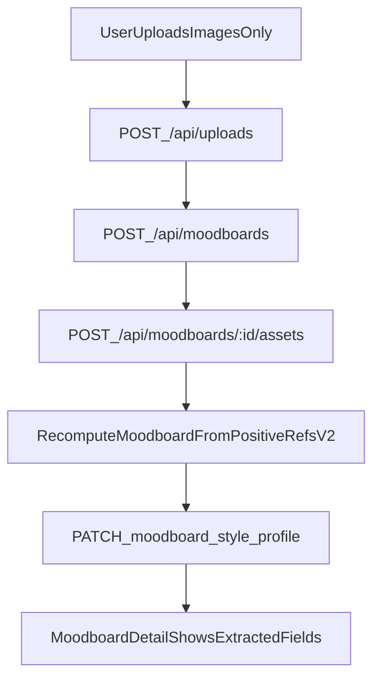

# Simplify moodboard creation to upload-only + automatic extraction

## Goal

- Moodboard creation should ask for **images only** (no name/description, no bucket selection, no review step).
- Backend should **auto-extract** all moodboard details from the uploaded images and populate a richer `moodboards.style_profile` that supports **catalog + ads**.

## Key product decisions (confirmed)

- **No buckets at creation**: treat the uploaded set as one pool of “positive references”.
- **No review step**: create moodboard immediately; analysis runs asynchronously/best-effort.
- **No name at creation**: backend assigns a default name; optional rename later.

## Current baseline

- Moodboard create currently requires `name` (`POST /api/moodboards`) and UI collects name/description.
- Moodboard assets attach triggers best-effort analysis today (summaries only):
  - `/api/moodboards/:id/assets` calls `recomputeMoodboardAssetSummaries()` in [`lib/moodboards/analysis.ts`](/Users/tapan/Projects/speedbreakers/contentshop/lib/moodboards/analysis.ts).

## New target data model (in `style_profile`)

- Persist a versioned, structured object (no DB migration required since `style_profile` is JSONB):
  - `version: 2`
  - `positive_refs`: `{ summary, spec, analyzed_at, signals }`
    - `signals`: `{ has_text:boolean, has_humans:boolean, has_logos:boolean, confidence:{...} }`
  - `design`: layout + shapes/motifs + graphics policy (needed for ad-style prompts)
  - `catalog`: policy constraints derived from the images (fidelity/props/background/variation)
  - `ads`: design system constraints (palette hex suggestions if detectable, logo/copy/layout guidelines, text safe zones)
  - Keep/derive existing pieces: `typography`, `do_not`, `backgrounds_analysis_summary`, `models_analysis_summary`

## Architecture changes (high level)

## Implementation plan

### 1) Update moodboard creation API to allow no name

- File: [`app/api/moodboards/route.ts`](/Users/tapan/Projects/speedbreakers/contentshop/app/api/moodboards/route.ts)
- Change `createSchema` so `name` is optional.
- If missing/blank, set default name `Untitled moodboard`
- Keep `style_profile` optional default `{}`.

### 2) Update moodboards UI creation flow: images-only

- File: `[app/(dashboard)/dashboard/moodboards/page.tsx](/Users/tapan/Projects/speedbreakers/contentshop/app/\\\(dashboard)/dashboard/moodboards/page.tsx)`
- Replace create modal form:
  - Remove required Name/Description fields.
  - Add file picker (multi-image).
  - Upload each image via `POST /api/uploads` with kind `moodboard_reference_positive`.
  - Create moodboard via `POST /api/moodboards` with no name.
  - Attach uploaded file IDs to moodboard via `POST /api/moodboards/:id/assets` with kind `reference_positive`.
  - Navigate to moodboard detail page.

### 3) Replace “positive refs summary” with structured extraction (v2)

- File: [`lib/moodboards/analysis.ts`](/Users/tapan/Projects/speedbreakers/contentshop/lib/moodboards/analysis.ts)
- Add a new analyzer for the pooled images, e.g. `analyzePositiveReferencesV2(urls, args)` that returns STRICT JSON covering:
  - **Visual style spec**: palette, lighting, camera/framing, composition, environment, props
  - **Design layer (ads)**: layout style, motifs/shapes, graphics policy, text-safe-zone suggestion, copy system rules, logo placement guidance
  - **Signals**: whether the images contain text/humans/logos
  - **Typography extraction** (only if `has_text`): infer typography *style* (sans/serif, weight feel, casing, spacing, alignment), and produce `typography.rules[]` + `do_not[]`
  - **Model/background summaries** from the same pool (only if relevant signals are true)

Notes:

- This is not OCR; it’s “style inference”. Keep it safe + robust by returning broad categories, not exact font names.
- Keep the current defensive cap (sample up to N images, e.g. 3–6).

### 4) Update recompute pipeline to populate v2 profile

- Still triggered on attach/detach in:
  - `[app/api/moodboards/[moodboardId]/assets/route.ts](/Users/tapan/Projects/speedbreakers/contentshop/app/api/moodboards/[moodboardId]/assets/route.ts)`
  - `[app/api/moodboards/[moodboardId]/assets/[assetId]/route.ts](/Users/tapan/Projects/speedbreakers/contentshop/app/api/moodboards/[moodboardId]/assets/[assetId]/route.ts)`
- In `recomputeMoodboardAssetSummaries()`:
  - Treat `reference_positive` assets as the pool.
  - Write the full structured v2 object into `style_profile`.
  - Optionally (recommended): if moodboard name is still default/untitled, auto-generate a name from the extracted keywords and update `moodboards.name`.

### 5) Update moodboard detail UI to show extracted v2 fields (read-only + optional edits)

- File: `[app/(dashboard)/dashboard/moodboards/[moodboardId]/page.tsx](/Users/tapan/Projects/speedbreakers/contentshop/app/(dashboard)/dashboard/moodboards/[moodboardId]/page.tsx)`
- Add sections:
  - Extracted **Visual style** (palette/lighting/camera/composition/environment/props/motifs)
  - Extracted **Catalog policy**
  - Extracted **Ads design system** (logo/copy/layout/text safe zones)
  - Extracted **Typography** (only if `has_text`)
  - Extracted **Models summary** (only if `has_humans`)
- Keep existing manual “Edit” dialogs, but default to showing auto-extracted values; allow overrides if desired.

### 6) Wire workflows to consume v2 fields

- Catalog:
  - Prefer structured fields when building prompts (background/model resolvers and `style_appendix`).
- Ads (prompt-only today):
  - Inject `ads` + `design` blocks (layout/copy/logo/palette guidance) into prompt construction in [`lib/workflows/generation/workflows.ts`](/Users/tapan/Projects/speedbreakers/contentshop/lib/workflows/generation/workflows.ts).

## Acceptance criteria

- User can create a moodboard by uploading images only.
- Moodboard is created immediately with a default name.
- Within moments (best-effort), moodboard detail shows:
  - catalog + ads style guidance derived from images
  - typography section populated only when text is present
  - models summary populated only when humans are present
- Catalog prompts and ads prompts visibly become more aligned with the extracted guidance.